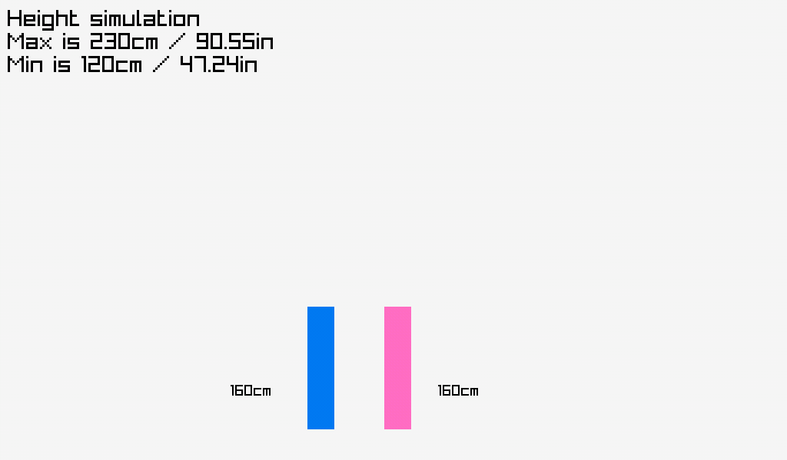
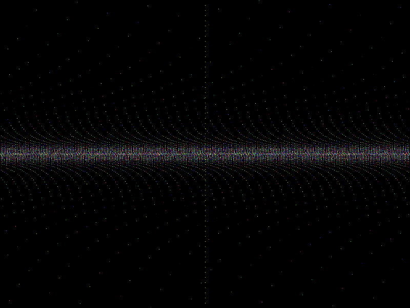
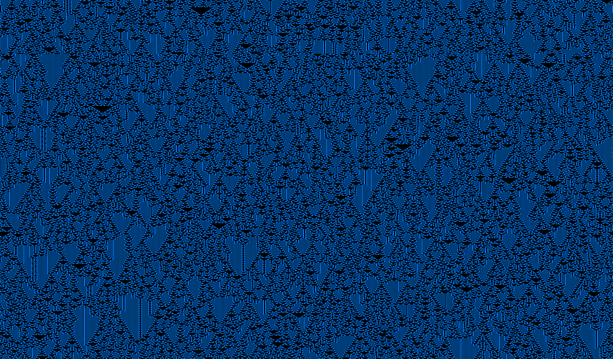

# raylib-lab
Experiments using raylib.

## Compiling the experiments:
Depending on the experiment (such as func.c) you'll need some extra libraries.

Check what the library linking looks like (like -lm) and add it to this command:
```
$ cc example.c -lraylib -o example
```

## Experiments going on:
`Height simulation`


`Mathematical functions`


`1D Automata`

